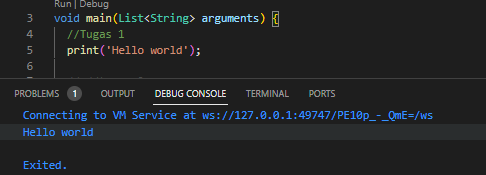
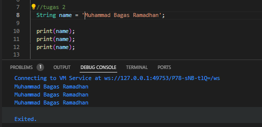
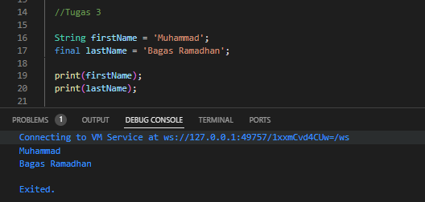
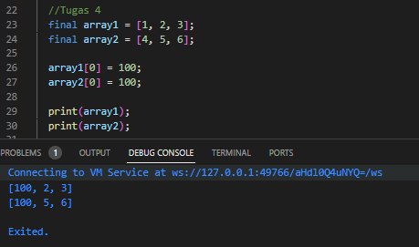
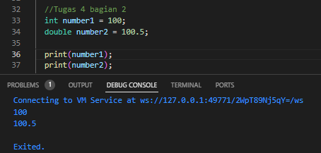
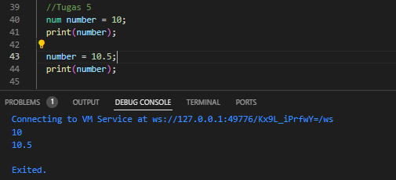
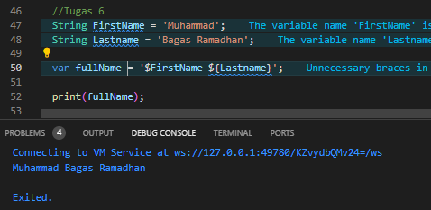
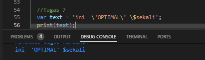
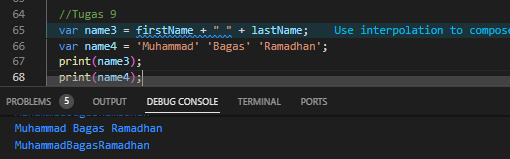
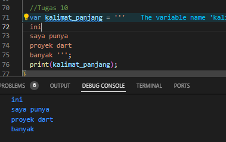

# Kuis

Nama : Muhammad Bagas Ramadhan
Kelas : 3G
NIM : 2141720120


## Tugas 1


mencetak hello world dengan (print)

## Tugas 2


Variabel name dideklarasikan dengan nilai 'Muhammad Bagas Ramadhan'.

-Mencetak isi variabel name.

-Mencetak isi variabel name lagi.

-Mencetak isi variabel name untuk ketiga kalinya.

## Tugas 3


-Variabel firstName dideklarasikan sebagai string dengan nilai 'Muhammad'.

-Konstanta (final) lastName dideklarasikan sebagai string dengan nilai 'Bagas Ramadhan'. Konstanta berarti nilainya tidak dapat diubah setelah deklarasi.

-Mencetak nilai variabel firstName ke layar.

-Mencetak nilai konstanta lastName ke layar.

-Hasil cetakan akan menampilkan "Muhammad" (dari variabel) dan "Bagas Ramadhan" (dari konstanta) ke layar.

## Tugas 4
 

Mendeklarasikan dua array, array1 dan array2, sebagai konstanta (final).

Mencoba mengubah elemen pertama dari array1 dan array2 menjadi 100 dengan pernyataan array1[0] = 100; dan array2[0] = 100;.
Oleh karena itu, perubahan terjadi pada index ke [0] pada array.

## Tugas 4 bagian 2
 

-Variabel number1 dideklarasikan sebagai integer dengan nilai 100.

-Variabel number2 dideklarasikan sebagai double dengan nilai 100.5. 

Kemudian, kode mencetak nilai dari number1 dan number2 ke layar.

-double dapat menyimpan bilangan pecahan, sementara int menyimpan bilangan bulat
Hasil cetakan akan menampilkan nilai 100 (dari number1) dan 100.5 (dari number2) ke layar.

## Tugas 5
 

Variabel number awalnya diisi dengan nilai 10 dan dicetak, menghasilkan output 10.

Nilai variabel number kemudian diubah menjadi 10.5, yang kemudian dicetak, menghasilkan output 10.5. 
Tipe data num memungkinkan penyimpanan bilangan bulat maupun bilangan pecahan.

## Tugas 6
 

Variabel FirstName dideklarasikan sebagai string dengan nilai 'Muhammad'.
Variabel Lastname dideklarasikan sebagai string dengan nilai 'Bagas Ramadhan'.
Variabel fullName dideklarasikan dengan menggabungkan nilai dari FirstName dan Lastname menggunakan string interpolation, yaitu ${FirstName} ${Lastname}.
Kode mencetak nilai fullName ke layar, yang akan menghasilkan output "Muhammad Bagas Ramadhan".

## Tugas 7
 

Ini menunjukkan bahwa karakter tanda kutip tunggal di tengah string dan karakter dollar ($) di dalam string tidak dianggap sebagai karakter khusus, melainkan sebagai bagian dari isi string.

## Tugas 8


-Variabel name1 menggabungkan variabel firstName dan lastName, tetapi tidak ada deklarasi sebelumnya untuk firstName dan lastName. Ini dapat menghasilkan nilai null atau kesalahan tergantung pada bahasa pemrograman yang digunakan.

-Variabel name2 menggabungkan tiga string berurutan tanpa operator penggabungan (+).-
Kode mencetak nilai name1 dan name2.

## Tugas 9


-Variabel name3 menggabungkan nilai firstName dan lastName dengan spasi di antaranya (misalnya, "Muhammad Bagas Ramadhan").

-Variabel name4 menggabungkan tiga string tanpa operator penggabungan (+) dan tanpa menggunakan spasi, menghasilkan string 'MuhammadBagasRamadhan'.

-Kode mencetak nilai name3 dan name4 ke layar. Output name3 adalah nama lengkap dengan spasi di antara nama pertama dan nama terakhir, sedangkan output name4 adalah penggabungan tiga string tanpa spasi.

## Tugas 10


menulis kalimat dengan variabel bernama kalimat_panjang yang berisi string panjang dengan tanda kutip tiga (```), ini menjadikan untuk membuat string multi-baris agar dapat menulis dengan baris baru.


